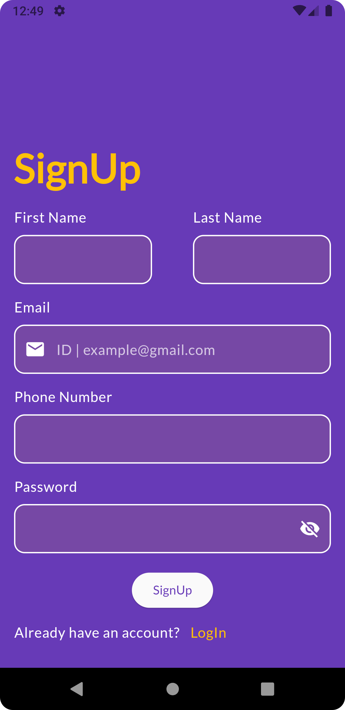
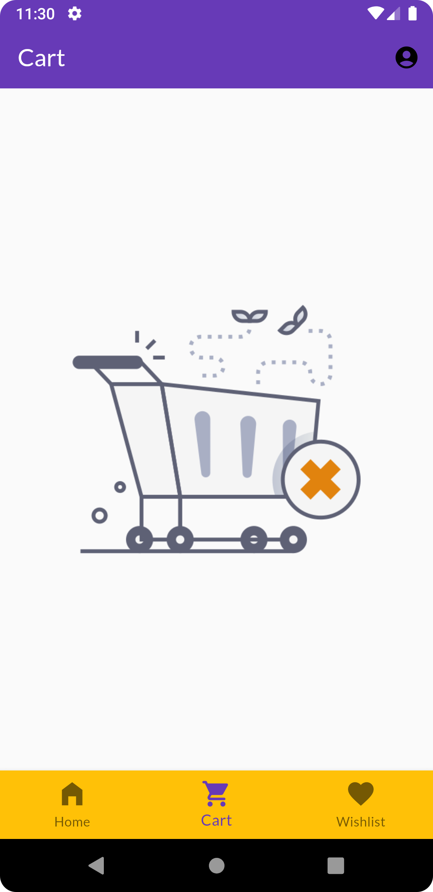
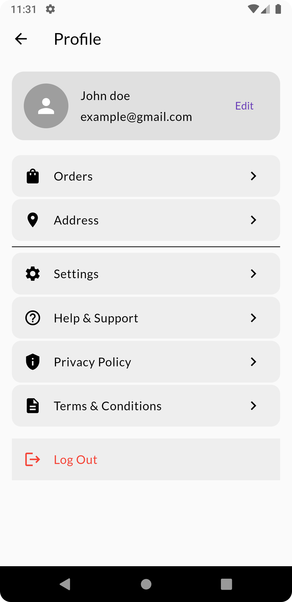

# 🛒 Flutter E-Commerce App

A fully functional **e-commerce application** built with **Flutter**, designed to provide a clean shopping experience — complete with product listings, cart management, checkout flow, and user authentication.

> ⚙️ Built using Flutter, Firebase, and modern state management.

---

## 📱 Features

- 👕 Product Listing with Categories
- 🔍 Product Detail View
- 🛍️ Add to Cart / Remove from Cart
- ✅ Cart Checkout Flow
- 🔐 Firebase Authentication (Login & Signup)
- 📦 Order Summary
- 💾 Fake Store Api for backend data
- 📱 Responsive UI across Android & iOS

---

## Screenshots

- Authentication (Login/SignUp)
  
  
- Home
  
- Cart
  
- Wishlist
  
- Profile
  

---

## 🧱 Tech Stack

- **Flutter** (Front-end)
- **Firebase Auth** (User Authentication)
- **['fakestoreapi'](https://fakestoreapi.com/products)** (Product and Order Data)
- **Riverpod** *(for state management)*
- **MVVM Architecture** + Feature-First Folder Structure

---

## 🔧 Getting Started

### Prerequisites

- Flutter SDK: [Install Guide](https://docs.flutter.dev/get-started/install)
- Firebase account + project setup
- Android Studio / VS Code

---

### 🚀 Firebase Setup

To run this app, set up your Firebase project:

1. Go to [Firebase Console](https://console.firebase.google.com/)
2. Create a Firebase project
3. Add Android/iOS apps to Firebase
4. Download:
    - `google-services.json` → place inside `android/app/`
    - `GoogleService-Info.plist` → place inside `ios/Runner/`
5. Enable:
    - Authentication (Email/Password)

Then run:

```bash
flutter pub get
flutterfire configure
flutter run
