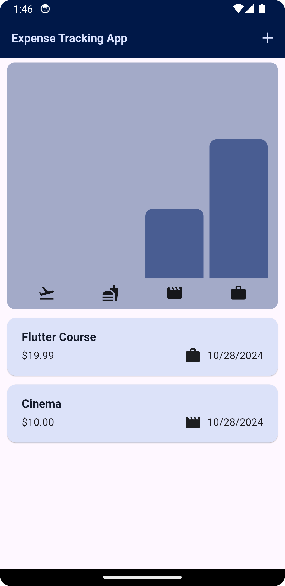
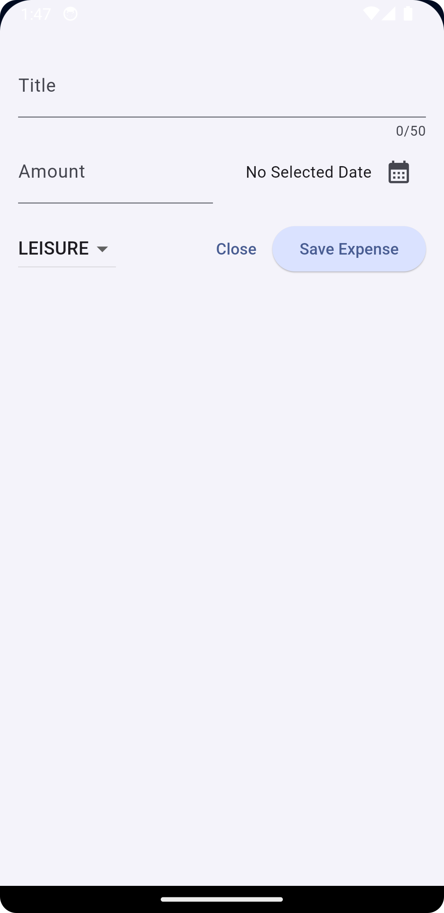

# Expense Tracking

The Expense Tracking application, built with flutter, help you monitor your daily expenses. Easily record your expenditures, categorize them and, visualize your spending habits through graph for better financial management.

## Features

- **Add Expenses**: Quickly log your daily expenses with details like amount, category, and date.
[//]: # (- **Edit Expenses**: Modify existing entries to keep your records accurate.)
- **Delete Expenses**: Remove entries that are no longer relevant.
[//]: # (- **View Summary**: Get an overview of your total expenses over a specified period.)
- **Graphical Comparison**: Visualize your spending patterns and compare expenses across different categories through interactive graphs.

## Screens

### 1. Expenses


### 2. Add New Expense


## Getting Started

To run this project locally, follow these steps:
(Sorry for this inconvenience but you have to clone whole repo that contains multiple projects.)

1. **Clone the Repository**:
   ```bash
   git clone https://github.com/neeraj-bhatt/flutter-projects.git

2. **Install Dependencies** - Navigate to the project directory and run the following command to install the required dependencies:
   flutter pub get

3. **Run the App**:
   flutter run

## Dependencies
- [Flutter](https://flutter.dev/) - A UI toolkit for building natively compiled applications for mobile, web, and desktop from a single codebase.
- Other dependencies will be managed automatically via `pubspec.yaml`.

## Project Structure
-lib/main.dart: The entry point of the application.
-lib/expenses_list/: Contains the design for expenses item.
-lib/charts/: Contains the custom Bar Graph used for comparison.

## How to Contribute
If you'd like to contribute to this project:
-Fork the repository.
-Create a new branch (git checkout -b feature-branch).
-Commit your changes (git commit -m 'Add new feature').
-Push to the branch (git push origin feature-branch).
-Open a Pull Request.

## License
This project is licensed under the MIT License.
