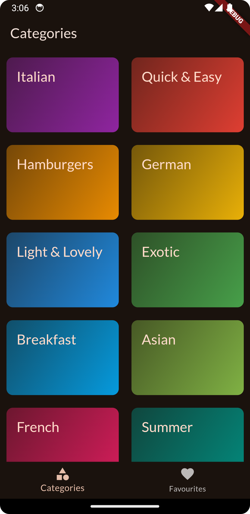
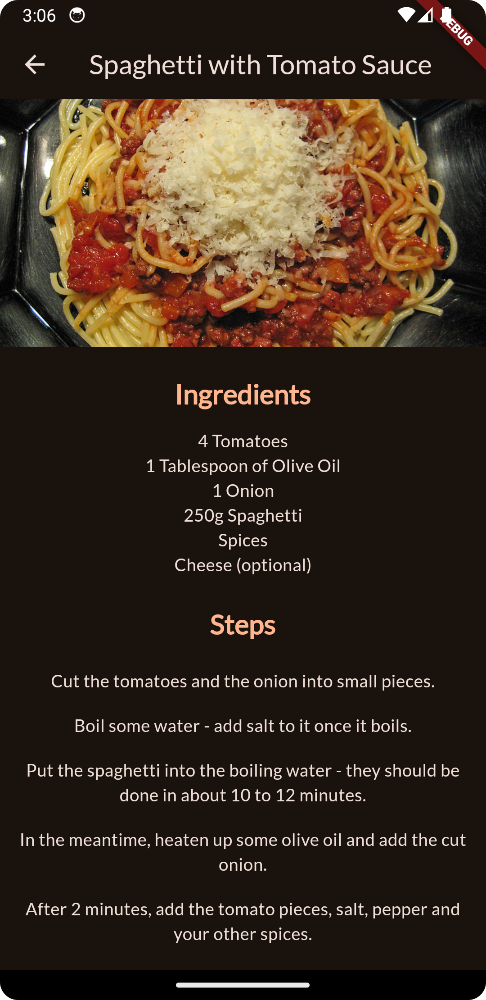

# Foodie_Goodie

Foodie_Goodie is a simple meal browsing Android application built using the Flutter framework. The app allows users to browse meals from different categories, view detailed descriptions of each meal, and mark meals as favorites. All the functionalities are efficiently managed through a tabbed navigation interface.

## Features

- **Category-based Meal Browsing**: Users can browse meals by categories.
- **Detailed Meal Description**: By selecting a meal, users can view its complete description (Ingredients, Steps involved).
- **Favorites**: Users can mark meals as favorites and access them in a separately.
- **Tabbed Navigation**: The app uses tabbed navigation to switch between the Categories and Favorites screens easily.

## Screens

### 1. Categories


### 2. Meals


### 3. Meal Description



### 4. Favourites
A list of meals marked as favorites by the user, easily accessible from a dedicated tab.

## Getting Started

To run this project locally, follow these steps:

1. **Clone the Repository**:
   ```bash
   git clone https://github.com/neeraj-bhatt/foodie_goodie.git
   
2. **Install Dependencies** - Navigate to the project directory and run the following command to install the required dependencies:
   ```bash
   flutter pub get

3. **Run the App**:
   ```bash
   flutter run

## Dependencies
- dependencies will be managed automatically via `pubspec.yaml`.
