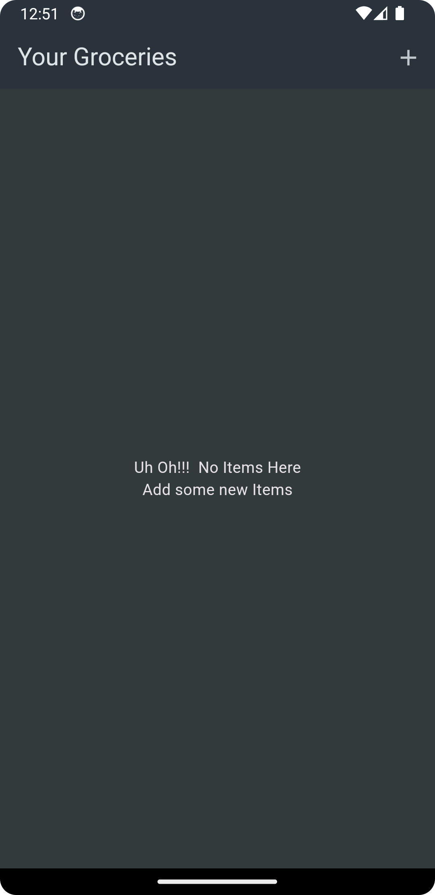
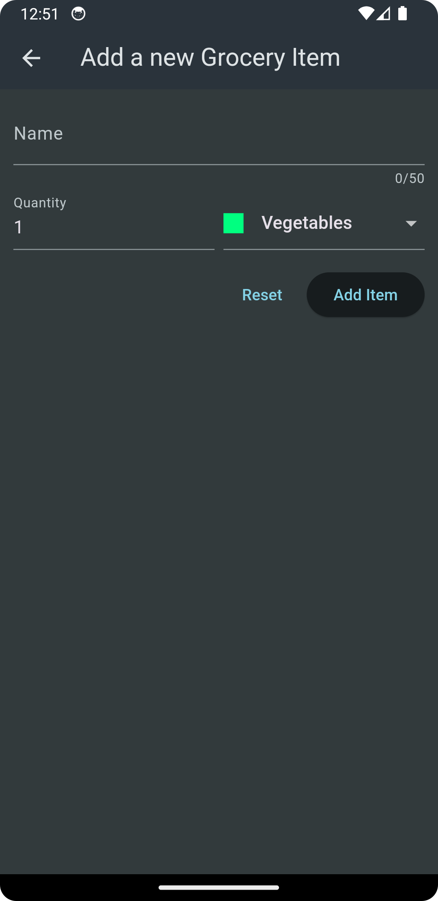

# Shopping List

The Shopping List application, built with Flutter, helps you manage your grocery shopping by allowing you to store and organize a list of items. Easily add, edit, and delete items to ensure you never forget anything at the store.

## Features

- **Add Items**: Quickly add grocery items to your shopping list.

[//]: # (- **Edit Items**: Update the details of any item in your list.)
- **Delete Items**: Remove items from your list when they are no longer needed.
- **View List**: Display all your added grocery items in a clear format.

## Screens

### 1. Empty List


### 2. Grocery List


### 3. Add new Item


## Getting Started

To run this project locally, follow these steps:
(Sorry for this inconvenience but you have to clone whole repo that contains multiple projects.)

1. **Clone the Repository**:
   ```bash
   git clone https://github.com/neeraj-bhatt/flutter-projects.git

2. **Install Dependencies** - Navigate to the project directory and run the following command to install the required dependencies:
   flutter pub get

3. **Run the App**:
   flutter run

## Dependencies
- [Flutter](https://flutter.dev/) - A UI toolkit for building natively compiled applications for mobile, web, and desktop from a single codebase.
- Other dependencies will be managed automatically via `pubspec.yaml`.

## Project Structure
-lib/main.dart: The entry point of the application.
-lib/screens/: Contains the different screen components (grocery_list, new_item, etc.).
-lib/widgets/: Contains the custom widgets used across the app.

## How to Contribute
If you'd like to contribute to this project:
-Fork the repository.
-Create a new branch (git checkout -b feature-branch).
-Commit your changes (git commit -m 'Add new feature').
-Push to the branch (git push origin feature-branch).
-Open a Pull Request.

## License
This project is licensed under the MIT License.
