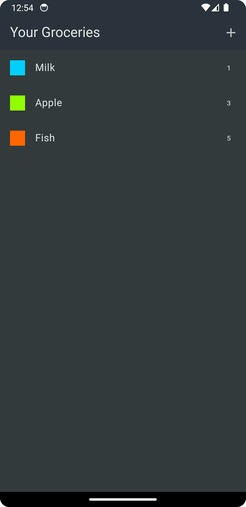

# Shopping List

The Shopping List application, built with Flutter, helps you manage your grocery shopping by allowing you to store and organize a list of items. Easily add, edit, and delete items to ensure you never forget anything at the store.

## Features

- **Add Items**: Quickly add grocery items to your shopping list.
- **Delete Items**: Remove items from your list when they are no longer needed.
- **View List**: Display all your added grocery items in a clear format.

## Screens

### 1. Empty List


### 2. Grocery List


### 3. Add new Item


## Getting Started

To run this project locally, follow these steps:

1. **Clone the Repository**:
   ```bash
   git clone https://github.com/neeraj-bhatt/flutter-projects.git

2. **Install Dependencies** - Navigate to the project directory and run the following command to install the required dependencies:
   ```bash
   flutter pub get

3. **Run the App**:
   ```bash
   flutter run

## Dependencies
- dependencies will be managed automatically via `pubspec.yaml`.

